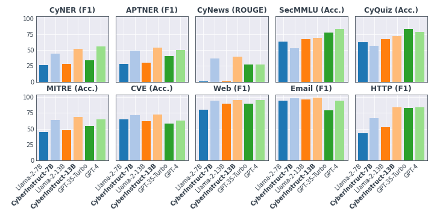

# CyberBench

## Description

CyberBench is a multi-task benchmark designed to evaluate the performance of Large Language Models (LLMs) for Natural Language Processing (NLP) tasks related to cybersecurity. It encompasses 10 datasets covering tasks such as named entity recognition (NER), summarization (SUM), multiple choice (MC), and text classification (TC). This benchmark provides insights into the strengths and weaknesses of various mainstream LLMs, aiding in the development of more effective models for cybersecurity applications. For more details, please refer to our [paper](http://aics.site/AICS2024/AICS_CyberBench.pdf).

## Prerequisites

Ensure you have Python version 3.10 or higher installed on your system.

## Installation

Install the required Python packages using pip and the `requirements.txt` file:

```bash
pip install -r requirements.txt
```

## Data

To generate the benchmark data `data/cyberbench.csv` for evaluating LLMs, run the following command:

```bash
python src/data.py
```

The datasets will be automatically downloaded and preprocessed.

## Models

Save the models in the `models` folder for Hugging Face models. For OpenAI models, you will need an OpenAI API key.

## Evaluation

To evaluate the LLM with CyberBench tasks, use the following command:

```bash
python src/evaluation.py --model MODEL --embedding EMBEDDING --datasets cyberbench
```

Please note that `MODEL` and `EMBEDDING` should correspond to the LLM and embedding names in the `models` folder.

## Results



## License

CyberBench is licensed under the Apache-2.0 License. See the [LICENSE](LICENSE) file for details.

### Maintenance Level

This repository is maintained to fix bugs and ensure the stability of the existing codebase. However, please note that the team does not plan to introduce new features or enhancements in the future.

## Reference

If you find CyberBench useful in your research, please cite our paper:

Liu Z., Shi, J., and Buford, J. F., "CyberBench: A Multi-Task Benchmark for Evaluating LLMs in Cybersecurity Applications", AAAI-24 Workshop on Artificial Intelligence for Cyber Security (AICS), 2024.

```bibtex
@misc{liu2024cyberbench,
  title={Cyberbench: A multi-task benchmark for evaluating large language models in cybersecurity},
  author={Liu, Zefang and Shi, Jialei and Buford, John F},
  howpublished={AAAI-24 Workshop on Artificial Intelligence for Cyber Security (AICS)},
  year={2024}
}
```

Open Source @ JPMorgan Chase
